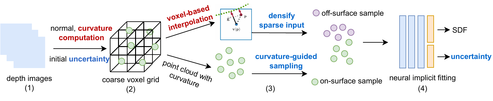
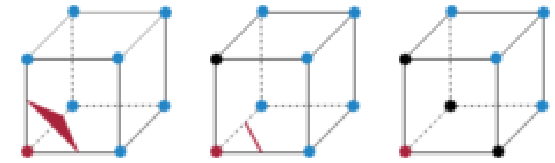
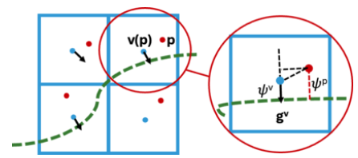

# Enhancing Surface Neural Implicits with Curvature-Guided Sampling and Uncertainty-Augmented Representations

[GCPR 2024](https://www.gcpr-vmv.de/year/2024) and [ECCV 2024 workshop](https://3d-in-the-wild.github.io/)


📰 [Paper](https://arxiv.org/abs/2306.02099)  💻[Code]() 📣 [Webpage](https://sangluisme.github.io/projects/3_project/)

[Lu Sang](https://sangluisme.github.io/), [Abhishek Saroha](https://cvg.cit.tum.de/members/saroha) [Maolin Gao](https://maolingao.github.io/), and [Daniel Cremers](https://cvg.cit.tum.de/members/cremers) 

---



This code include two parts:
- dense depth (RGB-D) tracking and mapping (pipeline (1) to (2))
- neural implicit fitting (pipeline (2) to (4))

---

```text
@inproceedings{sang2023enhanching,
  title = {Enhancing Surface Neural Implicits with Curvature-Guided Sampling and Uncertainty-Augmented Representations},
  author = {Sang, Lu and Saroha, Abhishek and Gao, Maolin and Cremers, Daniel},
  booktitle = {ECCVW},
  year = {2024},
}
```

## 🔧 Data Preparation
We offer 2 [synthetic datasets](https://drive.google.com/file/d/1-qAWGg0Ji99W2O8NT5FVbZmUVr-61gGE/view?usp=sharing) example and one real-world dataset [TUM-RGBD dataset](https://cvg.cit.tum.de/data/datasets/rgbd-dataset).

Please download the synthetic data and extract it and put it in [data](data). It includes two objects with synthetic noisy depth and camera intrinsics file. 

**To deal with your own data, please either struct your data format as our synthetic data or as TUM-RGBD data.**

Synthetic dataset structure:
```
armadillo
    |--- depth
        |--- 001.png
        |--- 002.png
        |--- ...
    |--- rgb
        |--- 001.png
        |--- 002.png
        |--- ...
    intrinsics.txt
    pose.txt (optional)
```
TUM RGBD structure:

```
rgbd_dataset_freiburg3_desk
    |--- depth
        |--- (timestamp 1).png
        |--- (timestamp 2).png
        |--- ...
    |--- rgb
        |--- (timestamp 1).png
        |--- (timestamp 2).png
        |--- ...
    associated.txt
    depth.txt
    rgb.txt
    intrinsics.txt
    groundtruth.txt (optional)
```
## 🔨 Code Preparation

- clone the repository with submodules
    ```
    git clone --recurse-submodules https://github.com/Sangluisme/curverture-sample-uncertainty-aware-sdf.git
    ```

- Dependences:

    Please install the following python packages
    pytorch (1.12.1+cu116)
    numpy, pyhocon, plotly, scikit-image, trimesh, cv2, pickle, plyfile.


### Uncertainty-Aware Marching Cubes


The code [weighted marching cubes](weighted_marching_cubes) enables marching cubes consider the uncertainty during marching cubes.
```
cd weighted_marching_cubes
python setup.py install
```


## Tracking and Mapping

We offer the code to estimate the camera pose if the poses are not available and integrate depth information into voxel grid.

Meanwhile, the code compute the **surface normal** and **Gaussian and mean Curvature** from depth (see [normal](third/normal_estimator.py) and [curvature](third/curvature_estimator.py)).

Tracking run:
```
python ./main/tracker.py --conf ./conf/tracking_synthetic.conf --expname armadillo (happy_buhdda) --results_dir ./exp --pose_file pose_normalized.txt (optional) --mc_resolution 256 --voxel_size 0.02
```
if there is no pose file, the code will estimate the camera pose. `--mc_resolution` is the grid resolution, high resolution means more memory is required. `--voxel_size`(meters) control each voxel size in meters. 


After tracking and mapping, the code will generates the following files:
```
init_mesh.ply (mesh without uncertainty)
init_weighted_mesh.ply (mesh considered uncertainty)
init_pc.ply
init_voxel_pc.ply (point cloud with curvature info)
tsdf.pkl (voxel info embedded point cloud)
tracking_pose.txt (if estimate pose)
```

## Neural Surface Fitting
Please first run `tracker.py` to generates `tsdf.pkl` then run this part.
```
python ./main/reconstructer.py --conf ./conf/recon.conf --expname armadillo (happy_buhdda) --results_dir ./exp --input_level 256
```
(`--input_level` please match the `mc_resolution` in `tracker.py`)

- We offer sample points using curvature info, the ratio of `median`, `high`, `low`curvature proportion is controlled in configure file under `sampling` (`proportions` and `percentiles`).

- We offer extra sample as shown in the following figure.


    Configure it in `recon.conf`, under `sampling`, `sampler=datasets.voxel_sampler.ExtraSampler`.

- We offer integrating our curvature and extra sampling with [IGR](https://github.com/amosgropp/IGR) and [neural-pull](https://github.com/mabaorui/NeuralPull). 

    Configure it in `recon.conf`, under `sampling`, `sampler=datasets.voxel_sampler.IGRSampler` or `sampler=datasets.voxel_sampler.NerualPullSampler`.


